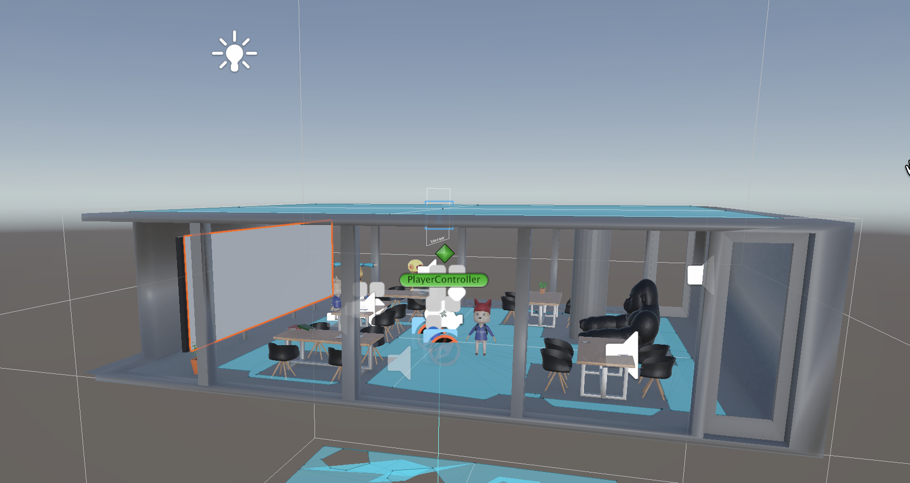
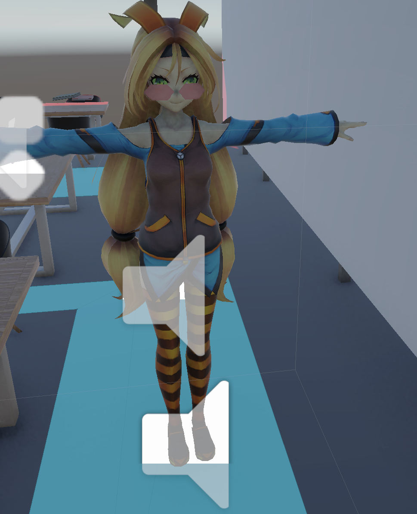
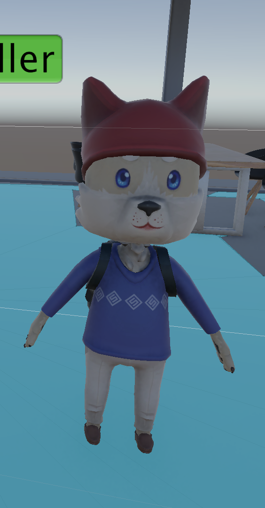

# LangsamVRProject
Welcome to the LangsamVRProject project.

### **Motivation**

The goal was to create an indoor environment where people can move around naturally, interact with objects on tables, and observe non-player characters behaving inside the space.

Also, the motivation behind this project was to explore how VR can feel more immersive than the desktop applications. Player can enter the room, walk around it, pick up objects, and trigger reactions from characters by approaching them. We wanted to combine environment design, object interaction, and character behaviors into one complete VR experience.

### **Design**

It takes place inside a Langsam Library room environment. The room has walls, flooring, tables, and furniture arranged so the player can navigate naturally through the space. The room was designed to feel interactive rather than empty. Furniture placement was important because it created movement paths for characters and gave users surfaces to place objects.

We use Unity-chan character model as one of the interactive models. She walks to a table, picks up a phone, performs a phone conversation animation, places the phone back down, and then resumes wandering around the room. This character helped demonstrate the pathfinding using NavMesh, animation transitions, object interaction, and autonomous behavior.

We also used one of the wolf characters to have him move around the room. The other wolf reacts when the player approaches him. When the user gets close enough, the wolf plays the audio. This added life to the room and gave the player a reason to explore the environment.

Several grabbable objects were added to the room. The player can use Meta Quest controllers to pick up and move objects. Physics and collision systems were adjusted so objects such as laptop, mug, phones, room props can rest on tables instead of falling through surfaces.

We also wanted the room to feel active and believable. Instead of static decorations, the environment contains moving characters, interactive objects, and triggered responses.

### **Process**

This application was developed in Unity as a VR room experience that combined environment design, character behavior, and object interaction into one scene. The project was organized inside SampleScene, where the room layout, lighting, VR interaction system, props, and characters were separated into groups in the Unity hierarchy so the scene was easier to manage during development. The hierarchy includes a teleport floor, camera rig, interaction components, furniture groups, table props, two wolf characters, Unity-chan, audio sources, and event system objects, showing how the project was structured around both environment elements and interactive behaviors.

The code was structured by behavior, with separate scripts controlling different parts of the experience. MoveToPhoneTarget.cs handled the Unity-chan character by using a NavMeshAgent, Animator, coroutines, and an AudioSource to move the character to the phone, play a pickup animation, attach the phone to the character’s hand, trigger a talking sequence, return the phone to the table, and then resume wandering around the room. Wolf_Wandering.cs controlled one wolf’s autonomous movement by selecting random valid positions on the NavMesh and updating the walking animation based on the agent’s velocity. Wolf_Interact_with_Player.cs handled the triggered interaction for the second wolf, detecting when the player entered the trigger area and then playing audio and optionally displaying text feedback. Detect_player.cs used a similar trigger system to detect the player and print a response message, while PlaceOnTable.cs used a downward raycast to help objects align correctly on a table surface instead of clipping or falling through.

The project used a combination of Unity and Meta XR tools to support VR interaction and scene behavior. Installed packages shown in the project include Meta XR Core SDK, Meta XR Interaction SDK, Meta XR Interaction SDK Essentials, XR Interaction Toolkit, XR Plugin Management, OpenXR Plugin, XR Core Utilities, Input System, AI Navigation, Animation Rigging, and Universal Render Pipeline. These tools supported controller-based interaction, player movement, character pathfinding, animation control, and rendering. Imported assets also included models and content packages such as Unity-Chan! Model, Character Pack: Free Animal People Sample, Free Laptop, [Free] Phone, Office Pack - Free, and Nature - Essentials, which helped build the room and populate it with interactive objects and characters.

To access and run the project, the user would open the Unity project, load the main scene, and run it through the Unity editor or build it to the target VR headset.

### **Challenges and Future Work**

### **AI Usage**

AI was used as a helper during the development process to figure out the steps needed for different tasks. It was especially useful for understanding how to approach certain features, where to find tools or settings in Unity, and what sequence of steps to follow when solving technical issues.
